# R1: Rate Limit & Retry Rule Examples

## Overview

**Rule:** R1 – Rate Limit & Retry  
**Severity:** `must` (blocks PR)  
**Purpose:** Ensure outbound API/HTTP nodes have retry + backoff so transient 429s/timeouts do not drop or duplicate work.

**FlowLint check (how R1 detects violations):**
- Finds API-like nodes (HTTP Request, Slack, Google, Ads, generic HTTP) on the happy-path
- Looks for `options.retry` on those nodes
- If missing/empty → R1 violation (must-fix)
- Suggested default: 3 attempts, exponential backoff, 500ms base with jitter

**Symptoms when missing retries:** flaky runs, partial syncs, lost messages, duplicated replays when upstream retries the webhook.

---

## 🔧 How to Fix R1 in n8n (2 steps)

1. Open the API node (e.g., **HTTP Request**, **Slack**, **Google Sheets**)
2. Set **Options → Retry on Fail** (or add `options.retry` in JSON):
   - `count: 3`
   - `strategy: exponential`
   - `baseMs: 500`
   - `maxDelay: 5000`
   - `jitter: true`

Optional but recommended:
- Cap concurrency at 5 for bulk imports
- Add circuit-breaker logic (IF node) after repeated failures

---

## Example 1: ❌ BAD – No Retry/Backoff

File: `bad-example.json`

```mermaid
%%{init: { "theme": "base", "themeVariables": { "primaryColor": "#38bdf8", "secondaryColor": "#fbbf24", "tertiaryColor": "#e2e8f0", "primaryTextColor": "#0f172a", "lineColor": "#94a3b8", "edgeLabelBackground": "#e2e8f0", "background": "transparent" } } }%%
graph LR
    A["🔔 Webhook Trigger<br/>(new lead)"] -->|raw payload| B["🌐 Create Lead (API)<br/>❌ no retry/backoff"]

    style A fill:#fff3cd
    style B fill:#f8d7da
```



**What happens:** One transient 429/timeout fails the run; webhook retries may re-send and create duplicates downstream.

**FlowLint output:**
```
❌ R1 (must): Missing retry/backoff for node "Create Lead (API)".
Suggestion: retry {count:3, strategy:'exponential', baseMs:500}
```

---

## Example 2: ✅ GOOD – Exponential Retry with Jitter

File: `good-example.json`

```mermaid
%%{init: { "theme": "base", "themeVariables": { "primaryColor": "#38bdf8", "secondaryColor": "#22c55e", "tertiaryColor": "#e2e8f0", "primaryTextColor": "#0f172a", "lineColor": "#94a3b8", "edgeLabelBackground": "#e2e8f0", "background": "transparent" } } }%%
graph LR
    A["🔔 Webhook Trigger<br/>(new lead)"] -->|raw payload| B["🌐 Create Lead (API)<br/>✅ retry x3, exp backoff, jitter"]

    style A fill:#d4edda
    style B fill:#d4edda
```



**Why this passes:**
- `options.retry` present with 3 attempts, exponential backoff, jitter
- Handles 429/5xx bursts without failing the workflow
- Safe to combine with concurrency cap (max 5) for heavy imports

**FlowLint output:**
```
✅ PASS
Retry/backoff configured for API node.
```

---

## Configuration (`.flowlint.yml`)

```yaml
rules:
  rate_limit_retry:
    enabled: true
    max_concurrency: 5
    default_retry:
      count: 3
      strategy: exponential
      base_ms: 500
```

- **max_concurrency**: advisory cap for bulk jobs (helps avoid burst limits)
- **default_retry**: used in suggestions if a node is missing retries

---

## Test This Rule

1) Import `bad-example.json`, hit a test endpoint that returns HTTP 429 → FlowLint flags R1.  
2) Import `good-example.json`, repeat → FlowLint passes (workflow retries up to 3 times with jitter).  
3) For CI: include these files in a PR; the FlowLint Check Run should show one must-fix annotation for the bad example and none for the good one.

---

## Related Rules

- **R2** Error Handling: forbid `continueOnFail` on critical paths
- **R3** Idempotency: prevent duplicates when webhooks retry
- **R12** Unhandled Error Path: ensure errors are routed

