# R10: Naming Convention (No Generic Node Names)

## Overview

**Rule:** R10 – Naming Convention  
**Severity:** `nit`  
**Purpose:** Prevent generic node names (e.g., "HTTP Request", "Set", "IF"). Names should describe intent so reviewers understand the flow quickly.

**FlowLint check (how R10 detects warnings):**
- Compares node names to a denylist of generic titles (configurable)
- Flags names like `HTTP Request`, `Set`, `If`, `Function`, `Webhook`
- Encourages intent-driven names (“Create Lead API”, “Filter VIPs”)

**Why it matters:** Clear names speed up reviews, debugging, and handoffs.

---

## 🔧 How to Fix R10 in n8n

1. Rename nodes to describe **what** they do and **why**.  
2. Include target system or condition in the name (e.g., “Push to CRM”, “Filter Paid Plans”).  
3. Keep names short but specific.

---

## Example 1: ⚠️ BAD – Generic Names

File: `bad-example.json`

```mermaid
%%{init: { "theme": "base", "themeVariables": { "primaryColor": "#38bdf8", "secondaryColor": "#fbbf24", "tertiaryColor": "#e2e8f0", "primaryTextColor": "#0f172a", "lineColor": "#94a3b8", "edgeLabelBackground": "#e2e8f0", "background": "transparent" } } }%%
graph LR
    A["🔔 Webhook"] --> B["HTTP Request"] --> C["Set"]

    style A fill:#fff3cd
    style B fill:#f8d7da
    style C fill:#f8d7da
```



**FlowLint output:**
```
⚠️ R10 (nit): Generic node names detected ("HTTP Request", "Set").
Rename to reflect intent.
```

---

## Example 2: ✅ GOOD – Intentful Names

File: `good-example.json`

```mermaid
%%{init: { "theme": "base", "themeVariables": { "primaryColor": "#38bdf8", "secondaryColor": "#22c55e", "tertiaryColor": "#e2e8f0", "primaryTextColor": "#0f172a", "lineColor": "#94a3b8", "edgeLabelBackground": "#e2e8f0", "background": "transparent" } } }%%
graph LR
    A["🔔 Webhook"] --> B["🌐 Create Lead (CRM API)"] --> C["🧭 Map lead fields"]

    style A fill:#d4edda
    style B fill:#d4edda
    style C fill:#d4edda
```



**Why this passes:**
- Names show system and purpose (Create Lead, Map lead fields)
- Easier review/debug; no generic labels

---

## Configuration (`.flowlint.yml`)

```yaml
rules:
  naming_convention:
    enabled: true
    generic_names:
      - "http request"
      - "set"
      - "if"
      - "function"
      - "webhook"
```

---

## Test This Rule

1) Import `bad-example.json`; FlowLint warns about generic names.  
2) Import `good-example.json`; FlowLint passes.  
3) CI: include both in a PR; expect one `nit` annotation on the bad example.

---

## Related Rules

- **R4** Secrets: descriptive names help auditors spot secret use  
- **R7** Alert/Log: name alert nodes with channels/owners  
- **R5** Dead Ends: terminal nodes should be named intentionally (End/Stop)  
