# R11: Deprecated Nodes

## Overview

**Rule:** R11 – Deprecated Nodes  
**Severity:** `should`  
**Purpose:** Warn when workflows use node types marked as deprecated by your team/vendor so they can be migrated before removal.

**FlowLint check (how R11 detects warnings):**
- Compares node `type` against a configured deprecation list
- Flags matches with a warning and suggests replacement
- List is maintained in `.flowlint.yml` (per team)

**Why it matters:** Deprecated nodes lose support, miss security fixes, and may break on upgrades.

---

## 🔧 How to Fix R11 in n8n

1. Identify the replacement node (e.g., new API version or official integration).  
2. Recreate the node with the supported type and migrate credentials/fields.  
3. Remove the deprecated node from the flow.

---

## Example 1: ⚠️ BAD – Uses Deprecated HTTP (Legacy)

File: `bad-example.json`

```mermaid
%%{init: { "theme": "base", "themeVariables": { "primaryColor": "#38bdf8", "secondaryColor": "#fbbf24", "tertiaryColor": "#e2e8f0", "primaryTextColor": "#0f172a", "lineColor": "#94a3b8", "edgeLabelBackground": "#e2e8f0", "background": "transparent" } } }%%
graph LR
    A["🔔 Webhook"] --> B["🌐 HTTP Request (Legacy)<br/>⚠️ deprecated type"]

    style A fill:#fff3cd
    style B fill:#f8d7da
```



**FlowLint output:**
```
⚠️ R11 (should): Node type n8n-nodes-base.httpRequest (legacy) is deprecated. Replace with HTTP Request (v2) or vendor node.
```

---

## Example 2: ✅ GOOD – Migrated to Supported Node

File: `good-example.json`

```mermaid
%%{init: { "theme": "base", "themeVariables": { "primaryColor": "#38bdf8", "secondaryColor": "#22c55e", "tertiaryColor": "#e2e8f0", "primaryTextColor": "#0f172a", "lineColor": "#94a3b8", "edgeLabelBackground": "#e2e8f0", "background": "transparent" } } }%%
graph LR
    A["🔔 Webhook"] --> B["🌐 HTTP Request (v2)<br/>✅ supported"]

    style A fill:#d4edda
    style B fill:#d4edda
```



**Why this passes:**
- Uses the non-deprecated node type
- Ready for platform upgrades and security fixes

---

## Configuration (`.flowlint.yml`)

```yaml
rules:
  deprecated_nodes:
    enabled: true
    node_types:
      - "n8n-nodes-base.httpRequest"      # legacy version
      - "n8n-nodes-base.googleSheets"     # example; replace with official v2
      - "n8n-nodes-base.emailSend"        # example; replace with SMTP/Email v2
```

> Adjust the list to match your team's deprecation policy and vendor guidance.

---

## Test This Rule

1) Import `bad-example.json`; FlowLint warns about the deprecated node type.  
2) Import `good-example.json`; FlowLint passes.  
3) CI: include both in a PR; expect one `should` annotation on the bad example.

---

## Related Rules

- **R4** Secrets: migrating may unlock better credential handling  
- **R10** Naming: rename nodes to include target version during migration  
- **R12** Unhandled Error Path: ensure the replacement still has error edges  
