# R12: Unhandled Error Path

## Overview

**Rule:** R12 – Unhandled Error Path  
**Severity:** `must`  
**Purpose:** Ensure API/mutation nodes have an error branch so failures don’t disappear and downstream steps don’t run with bad state.

**FlowLint check (how R12 detects violations):**
- Finds API/mutation nodes (HTTP, DB writes, external services)
- Checks for an **error** edge
- If missing → R12 violation (must-fix)

**Why it matters:** Without an error path, retries or downstream actions can corrupt data and hide outages.

---

## 🔧 How to Fix R12 in n8n

1. Add an **error output** from critical nodes to a handler.  
2. Error handler should:
   - Alert/log (Slack/Email)
   - Optionally enqueue to DLQ
   - Stop or mark run as failed
3. Keep `continueOnFail` off (see R2) and pair with retry (R1) if appropriate.

---

## Example 1: ❌ BAD – No Error Branch

File: `bad-example.json`

```mermaid
%%{init: { "theme": "base", "themeVariables": { "primaryColor": "#38bdf8", "secondaryColor": "#fbbf24", "tertiaryColor": "#e2e8f0", "primaryTextColor": "#0f172a", "lineColor": "#94a3b8", "edgeLabelBackground": "#e2e8f0", "background": "transparent" } } }%%
graph LR
    A["🔔 Webhook"] --> B["🌐 Push to CRM<br/>❌ no error path"]
    B --> C["📝 Save to Sheet"]

    style A fill:#fff3cd
    style B fill:#f8d7da
    style C fill:#fff3cd
```



**FlowLint output:**
```
❌ R12 (must): Node "Push to CRM" has no error branch. Add an error handler before downstream steps.
```

---

## Example 2: ✅ GOOD – Error Path with Alert + DLQ

File: `good-example.json`

```mermaid
%%{init: { "theme": "base", "themeVariables": { "primaryColor": "#38bdf8", "secondaryColor": "#22c55e", "tertiaryColor": "#e2e8f0", "primaryTextColor": "#0f172a", "lineColor": "#94a3b8", "edgeLabelBackground": "#e2e8f0", "background": "transparent" } } }%%
graph LR
    A["🔔 Webhook"] --> B["🌐 Push to CRM"]
    B -->|success| C["📝 Save to Sheet"]
    B -->|error| D["🔔 Slack Alert"]
    D --> E["📦 DLQ (Queue)"]

    style A fill:#d4edda
    style B fill:#d4edda
    style C fill:#d4edda
    style D fill:#d4edda
    style E fill:#d4edda
```



**Why this passes:**
- Error edge exists and surfaces failures
- Payload saved to DLQ for replay
- Downstream success path only runs on success

---

## Configuration (`.flowlint.yml`)

```yaml
rules:
  unhandled_error_path:
    enabled: true
```

---

## Test This Rule

1) Import `bad-example.json`; FlowLint flags missing error path.  
2) Import `good-example.json`; FlowLint passes.  
3) CI: include both in a PR; expect one must-fix annotation on the bad example.

---

## Related Rules

- **R1** Rate Limit/Retry: retries before error branch  
- **R2** Error Handling: keep `continueOnFail` disabled  
- **R7** Alert/Log Enforcement: ensure error branch logs/alerts  
