# R13: Webhook Acknowledgment Pattern

## Overview

**Rule:** R13 – Webhook Acknowledgment Pattern
**Severity:** `must`
**Purpose:** Ensure webhooks acknowledge receipt immediately (200/204) before performing heavy processing to prevent timeouts and duplicate events.

**FlowLint check (how R13 detects violations):**
- Finds webhook trigger nodes
- Checks if heavy processing (HTTP requests, DB queries, AI/LLM calls) occurs before "Respond to Webhook" node
- If heavy operations detected before response → R13 violation (must-fix)

**Why it matters:** Without immediate acknowledgment, webhooks can:
- **Timeout** (>30s typical limit) and trigger retries
- **Process duplicates** from webhook provider retries
- **Get disabled** by webhook providers due to reliability issues

---

## 🔧 How to Fix R13 in n8n

1. Add **"Respond to Webhook"** node immediately after webhook trigger
2. Set response to 200 OK or 204 No Content
3. Perform **all heavy operations** after the response:
   - HTTP API calls
   - Database queries
   - AI/LLM requests
   - Long-running computations
4. Optionally: enqueue work to background queue for async processing

---

## Example 1: ❌ BAD – Heavy Processing Before Response

File: `bad-example.json`

```mermaid
%%{init: { "theme": "base", "themeVariables": { "primaryColor": "#38bdf8", "secondaryColor": "#fbbf24", "tertiaryColor": "#e2e8f0", "primaryTextColor": "#0f172a", "lineColor": "#94a3b8", "edgeLabelBackground": "#e2e8f0", "background": "transparent" } } }%%
graph LR
    A["🔔 Webhook"] --> B["🌐 HTTP Request<br/>❌ heavy before ack"]
    B --> C["🗄️ Database Write"]
    C --> D["✅ Respond (200)"]

    style A fill:#fff3cd
    style B fill:#f8d7da
    style C fill:#f8d7da
    style D fill:#fff3cd
```



**FlowLint output:**
```
❌ R13 (must): Webhook "Webhook" performs heavy processing before acknowledgment (risk of timeout/duplicates)
```

**Problems:**
- HTTP request (2-5s) + database write (1-2s) = 3-7s before response
- If total time >30s → timeout → duplicate event
- Webhook provider may disable endpoint

---

## Example 2: ✅ GOOD – Immediate Acknowledgment

File: `good-example.json`

```mermaid
%%{init: { "theme": "base", "themeVariables": { "primaryColor": "#38bdf8", "secondaryColor": "#22c55e", "tertiaryColor": "#e2e8f0", "primaryTextColor": "#0f172a", "lineColor": "#94a3b8", "edgeLabelBackground": "#e2e8f0", "background": "transparent" } } }%%
graph LR
    A["🔔 Webhook"] --> B["✅ Respond (200)<br/>✓ immediate ack"]
    B --> C["🌐 HTTP Request"]
    C --> D["🗄️ Database Write"]

    style A fill:#d4edda
    style B fill:#d4edda
    style C fill:#d4edda
    style D fill:#d4edda
```



**Why this passes:**
- Webhook acknowledged in <100ms
- Heavy processing happens after response
- No risk of timeout or duplicate events
- Webhook provider sees reliable endpoint

---

## Heavy Node Types

R13 considers these node types as "heavy operations":

- **HTTP requests:** `n8n-nodes-base.httpRequest`
- **Database queries:** `postgres`, `mysql`, `mongodb`
- **AI/LLM calls:** `openAi`, `anthropic`, `huggingFace`
- **Loops/batches:** Any loop or batch processing node

---

## Configuration (`.flowlint.yml`)

```yaml
rules:
  webhook_acknowledgment:
    enabled: true
    heavy_node_types:
      - n8n-nodes-base.httpRequest
      - n8n-nodes-base.postgres
      - n8n-nodes-base.mysql
      - n8n-nodes-base.mongodb
      - n8n-nodes-base.openAi
      - n8n-nodes-base.anthropic
      - n8n-nodes-base.huggingFace
```

**Customization:**
- Add/remove node types based on your infrastructure
- Enable/disable per environment via config overrides

---

## Test This Rule

1) Import `bad-example.json`; FlowLint flags missing immediate acknowledgment.
2) Import `good-example.json`; FlowLint passes.
3) CI: include both in a PR; expect one must-fix annotation on the bad example.

---

## Best Practices

### Pattern 1: Immediate Response (Recommended)
```
Webhook → Respond to Webhook (200) → HTTP Request → Database
```

### Pattern 2: Queue-Based (For Long Operations)
```
Webhook → Respond to Webhook (202 Accepted) → Enqueue Job → [Background Worker]
```

### Pattern 3: Idempotency Check + Response
```
Webhook → Check Idempotency Key → Respond to Webhook (200) → Process if New
```

---

## Related Rules

- **R1** Rate Limit/Retry: configure retries for downstream API calls
- **R3** Idempotency: prevent duplicate processing with unique event IDs
- **R12** Unhandled Error Path: ensure error handling after heavy operations

---

## Real-World Example

**Stripe webhook handler:**
```
1. Webhook receives payment event
2. Respond 200 OK immediately (<100ms)
3. Verify signature (fast)
4. Process payment (database + email notification)
5. If error: log to DLQ for retry
```

This prevents Stripe from disabling your webhook due to slow responses.
