# R14: HTTP Retry-After Header Compliance

## Overview

**Rule:** R14 – HTTP Retry-After Header Compliance
**Severity:** `should`
**Purpose:** Detect HTTP nodes with retry logic that ignore `Retry-After` headers from 429 (Too Many Requests) and 503 (Service Unavailable) responses.

**FlowLint check (how R14 detects violations):**
- Finds HTTP request nodes with retry enabled (`retryOnFail: true`)
- Checks if code/expressions reference `retry-after` or `retryAfter` headers
- If retry enabled but no Retry-After logic → R14 violation (should-fix)

**Why it matters:** Ignoring Retry-After headers causes:
- **Aggressive retry storms** hitting the same rate limit repeatedly
- **Wasted API quota** on failed attempts
- **Extended backoffs** or **IP blocking** from API providers
- **Potential API key suspension** for abuse

---

## 🔧 How to Fix R14 in n8n

1. **Add expression to parse Retry-After header:**
   ```javascript
   const retryAfter = $json.headers['retry-after'];
   const delay = retryAfter
     ? (parseInt(retryAfter) || new Date(retryAfter) - Date.now())
     : Math.min(1000 * Math.pow(2, $execution.retryCount), 60000);
   ```

2. **Use dynamic retry delay** based on server response

3. **Add jitter** (randomization) to prevent thundering herd:
   ```javascript
   const jitter = Math.random() * 1000;
   const delay = baseDelay + jitter;
   ```

4. **Respect provider-specific rate limits:**
   - **Stripe:** 100 req/s, Retry-After in seconds
   - **Shopify:** 2 req/s (REST), Retry-After in seconds
   - **Notion:** 3 req/s, Retry-After in seconds
   - **GitHub:** 5000 req/hr, X-RateLimit-Reset timestamp

---

## Example 1: ❌ BAD – Ignoring Retry-After

File: `bad-example.json`

```mermaid
%%{init: { "theme": "base", "themeVariables": { "primaryColor": "#38bdf8", "secondaryColor": "#fbbf24", "tertiaryColor": "#e2e8f0", "primaryTextColor": "#0f172a", "lineColor": "#94a3b8", "edgeLabelBackground": "#e2e8f0", "background": "transparent" } } }%%
graph LR
    A["🔔 Webhook Trigger"] --> B["🌐 HTTP Request to Stripe API<br/>❌ retryOnFail: true<br/>❌ Fixed 1s delay<br/>❌ Ignores Retry-After"]
    B -->|429 Too Many Requests| C["❌ Retry after 1s"]
    C -->|429 again| D["❌ Retry after 1s"]
    D -->|429 again| E["❌ API Ban"]

    style A fill:#fff3cd
    style B fill:#f8d7da
    style C fill:#f8d7da
    style D fill:#f8d7da
    style E fill:#f8d7da
```



**FlowLint output:**
```
⚠️ R14 (should): Node "Call Stripe API" has retry logic but ignores Retry-After headers (429/503 responses)
```

**Problems:**
- Server says "retry after 60 seconds" via `Retry-After: 60`
- n8n retries after 1 second (fixed delay)
- Hits rate limit repeatedly
- Gets IP blocked or API key suspended

---

## Example 2: ✅ GOOD – Respecting Retry-After

File: `good-example.json`

```mermaid
%%{init: { "theme": "base", "themeVariables": { "primaryColor": "#38bdf8", "secondaryColor": "#22c55e", "tertiaryColor": "#e2e8f0", "primaryTextColor": "#0f172a", "lineColor": "#94a3b8", "edgeLabelBackground": "#e2e8f0", "background": "transparent" } } }%%
graph LR
    A["🔔 Webhook Trigger"] --> B["🌐 HTTP Request to Stripe API<br/>✓ retryOnFail: true<br/>✓ Dynamic delay<br/>✓ Respects Retry-After"]
    B -->|429 + Retry-After: 60| C["✓ Wait 60s"]
    C -->|Success| D["✅ 200 OK"]

    style A fill:#d4edda
    style B fill:#d4edda
    style C fill:#d4edda
    style D fill:#d4edda
```



**Why this passes:**
- Parses `Retry-After` header from 429/503 responses
- Waits exact duration specified by server
- Fallback to exponential backoff if header missing
- No wasted retries, no API bans

---

## Retry-After Header Format

APIs return Retry-After in two formats:

### 1. Delay in seconds (most common)
```
HTTP/1.1 429 Too Many Requests
Retry-After: 60
```
**Parse with:** `parseInt(headers['retry-after'])`

### 2. HTTP date (absolute timestamp)
```
HTTP/1.1 503 Service Unavailable
Retry-After: Wed, 21 Oct 2025 07:28:00 GMT
```
**Parse with:** `new Date(headers['retry-after']) - Date.now()`

### Combined parsing logic:
```javascript
const retryAfter = $json.headers['retry-after'];
if (retryAfter) {
  // Try parsing as seconds first
  const seconds = parseInt(retryAfter);
  if (!isNaN(seconds)) {
    return seconds * 1000; // Convert to milliseconds
  }
  // Otherwise parse as HTTP date
  const date = new Date(retryAfter);
  return date - Date.now();
}
// Fallback: exponential backoff
return Math.min(1000 * Math.pow(2, $execution.retryCount), 60000);
```

---

## Configuration (`.flowlint.yml`)

```yaml
rules:
  retry_after_compliance:
    enabled: true
    suggest_exponential_backoff: true  # Suggest fallback if header missing
    suggest_jitter: true               # Add randomization to prevent thundering herd
```

**Disable for specific workflows:**
```yaml
rules:
  retry_after_compliance:
    enabled: false  # Disable R14 globally
```

Or use inline comments (future feature):
```javascript
// flowlint-disable retry_after_compliance
```

---

## Test This Rule

1. **Install FlowLint CLI:**
   ```bash
   npm install -g flowlint
   ```

2. **Scan bad example (should fail):**
   ```bash
   flowlint scan R14/bad-example.json
   ```
   **Expected output:**
   ```
   ❌ R14 (should): Node "Call Stripe API" has retry logic but ignores Retry-After headers
   ```

3. **Scan good example (should pass):**
   ```bash
   flowlint scan R14/good-example.json
   ```
   **Expected output:**
   ```
   ✅ No findings
   ```

---

## Best Practices

### 1. Always Respect Server Guidance
```javascript
// ✅ GOOD: Parse Retry-After
const retryAfter = $json.headers['retry-after'];
const delay = retryAfter ? parseInt(retryAfter) * 1000 : baseDelay;

// ❌ BAD: Fixed delay
const delay = 1000; // Ignores server's Retry-After
```

### 2. Implement Exponential Backoff as Fallback
```javascript
const retryAfter = $json.headers['retry-after'];
if (retryAfter) {
  return parseInt(retryAfter) * 1000; // Use server's guidance
}
// Fallback: exponential backoff with cap
return Math.min(1000 * Math.pow(2, $execution.retryCount), 60000);
```

### 3. Add Jitter to Prevent Thundering Herd
```javascript
const baseDelay = retryAfter || (1000 * Math.pow(2, $execution.retryCount));
const jitter = Math.random() * 1000; // 0-1000ms random
return baseDelay + jitter;
```

### 4. Cap Maximum Delay
```javascript
const delay = Math.min(parsedDelay, 300000); // Max 5 minutes
```

---

## Provider-Specific Rate Limits

### Stripe
- **Limit:** 100 requests/second
- **Header:** `Retry-After` (seconds)
- **Documentation:** https://stripe.com/docs/rate-limits

### Shopify
- **Limit:** 2 req/s (REST API), 1000 points/s (GraphQL)
- **Header:** `Retry-After` (seconds)
- **Documentation:** https://shopify.dev/api/usage/rate-limits

### Notion
- **Limit:** 3 requests/second
- **Header:** `Retry-After` (seconds)
- **Documentation:** https://developers.notion.com/reference/request-limits

### GitHub
- **Limit:** 5000 req/hr (authenticated)
- **Header:** `X-RateLimit-Reset` (Unix timestamp)
- **Documentation:** https://docs.github.com/en/rest/overview/resources-in-the-rest-api#rate-limiting

---

## Related Rules

- **R1: Rate Limit Retry** – Ensures retry is enabled for API calls (R14 enhances this)
- **R13: Webhook Acknowledgment** – Prevents timeout and duplicates in webhooks
- **R6: Long Running** – Limits iteration counts and timeouts

---

## Real-World Example: Stripe Payment Processing

**Scenario:** E-commerce workflow processing 1000 orders/hour during Black Friday

**Without R14 compliance (ignoring Retry-After):**
1. Hit rate limit (100 req/s)
2. Get 429 with `Retry-After: 60`
3. Retry after 1s (fixed delay)
4. Hit rate limit again
5. After 10 failed attempts → API key suspended
6. **Impact:** All payment processing stops

**With R14 compliance (respecting Retry-After):**
1. Hit rate limit (100 req/s)
2. Get 429 with `Retry-After: 60`
3. Wait exactly 60 seconds
4. Successfully process next batch
5. **Impact:** Smooth processing, no disruption

---

## Troubleshooting

### "Why am I still getting rate limited?"

1. **Check header case:**
   ```javascript
   // Headers are lowercase in n8n
   $json.headers['retry-after']  // ✅ Correct
   $json.headers['Retry-After']  // ❌ Wrong (uppercase)
   ```

2. **Verify header exists:**
   ```javascript
   if ('retry-after' in $json.headers) {
     console.log('Retry-After:', $json.headers['retry-after']);
   }
   ```

3. **Test with curl:**
   ```bash
   curl -I https://api.stripe.com/v1/charges -H "Authorization: Bearer sk_test_..."
   # Look for Retry-After header in 429 response
   ```

---

## Summary

| Aspect | Without R14 | With R14 |
|--------|-------------|----------|
| **Retry strategy** | Fixed delay | Server-guided delay |
| **API bans risk** | High | Low |
| **Wasted retries** | Many | Minimal |
| **Production reliability** | Fragile | Robust |
| **Provider relationship** | Poor (abuse) | Good (respectful) |

**Bottom line:** Always respect `Retry-After` headers to build reliable, production-ready workflows.

---

**Last Updated:** 2025-12-08
**FlowLint Version:** 0.5.0+
**Related Issue:** [#136](https://github.com/Replikanti/flowlint-app/issues/136)
