# R2: Error Handling (No `continueOnFail`)

## Overview

**Rule:** R2 – Error Handling  
**Severity:** `must` (blocks PR)  
**Purpose:** Forbid silent failure via `continueOnFail=true`. Fail fast and handle errors explicitly on a dedicated branch.

**FlowLint check (how R2 detects violations):**
- Scans nodes for `continueOnFail: true`
- If found → R2 violation (must-fix)
- Encourages explicit error paths (separate branch) instead of swallowing errors

**Why it matters:** `continueOnFail` hides 4xx/5xxs and data issues, leading to partial syncs, corrupt state, or duplicates when upstream retries.

---

## 🔧 How to Fix R2 in n8n

1. Open the offending node and **disable `Continue On Fail`**.  
2. Add an **error branch** to handle failures:
   - Log/alert (Slack, Email)
   - Dead-letter (Queue/DB)
   - Stop or mark the run as failed

Optional patterns:
- Add retry (R1) before the error branch
- Include correlation/idempotency IDs (R3) in logs

---

## Example 1: ❌ BAD – `continueOnFail=true`

File: `bad-example.json`

```mermaid
%%{init: { "theme": "base", "themeVariables": { "primaryColor": "#38bdf8", "secondaryColor": "#fbbf24", "tertiaryColor": "#e2e8f0", "primaryTextColor": "#0f172a", "lineColor": "#94a3b8", "edgeLabelBackground": "#e2e8f0", "background": "transparent" } } }%%
graph LR
    A["🔔 Webhook Trigger"] --> B["🌐 Create Lead (API)<br/>❌ continueOnFail=true"]
    B --> C["📝 Write to Sheet<br/>(keeps running even on 500s)"]

    style A fill:#fff3cd
    style B fill:#f8d7da
    style C fill:#fff3cd
```



**What happens:** API 500s are ignored; downstream nodes run with incomplete/invalid data. FlowLint flags R2.

**FlowLint output:**
```
❌ R2 (must): continueOnFail=true on node "Create Lead (API)".
Add an error branch instead of swallowing failures.
```

---

## Example 2: ✅ GOOD – Error Branch with Alert

File: `good-example.json`


**Why this passes:**
- `continueOnFail` disabled (default false)
- Error branch captures failures and notifies ops
- Downstream nodes only run on success

**FlowLint output:**
```
✅ PASS
No nodes with continueOnFail=true; error branch present.
```

---

## Configuration (`.flowlint.yml`)

```yaml
rules:
  error_handling:
    enabled: true
    forbid_continue_on_fail: true
```

---

## Test This Rule

1) Import `bad-example.json`, run against an endpoint that returns 500 → FlowLint flags R2.  
2) Import `good-example.json` and trigger the error path → FlowLint passes; Slack branch runs only on error.  
3) CI: include both files in a PR; the bad example should produce one must-fix annotation on the API node.

---

## Related Rules

- **R1** Rate Limit/Retry: add retry before the error branch  
- **R3** Idempotency: include request IDs in alerts/logs  
- **R12** Unhandled Error Path: ensure error edges exist on critical nodes  
