# R3: Idempotency Rule Examples

## Overview

**Rule:** R3 - Idempotency  
**Severity:** `must` (blocks PR)  
**Purpose:** Ensure mutation paths (database writes, API updates) have an idempotency guard to prevent duplicate processing when webhooks are retried.

### TL;DR (FlowLint signal)
- Has webhook/trigger? ✅
- Has mutation node? ✅
- Any upstream node params contain one of the key candidates (`eventId`, `messageId` by default)?  
  - Yes → pass  
  - No → fail

What this means: FlowLint only checks that an idempotency key (e.g., `eventId/messageId`) exists upstream and flows to the mutation. Preventing duplicates is done by the sink (DB UNIQUE + UPSERT/`ON CONFLICT`, idempotency header at the API, or cache-based dedup).

---

## What is Idempotency?

Idempotency means that **running the same operation multiple times produces the same result as running it once**. This is critical for webhooks because:

1. Network failures can cause webhook retries
2. Without idempotency, duplicate records or state changes occur
3. Example: User subscribed twice, charge applied twice, message stored twice

---

## The Rule Logic

1) Webhook/trigger present?  
2) Mutation node present (write/insert/update/delete/API POST, etc.)?  
3) Any upstream node has a param name/value containing a configured key? (`eventId`, `messageId` by default)  
→ Yes: pass. No: fail.

**Default key field candidates:** `eventId`, `messageId` (Configurable via `.flowlint.yml`)

---

## 🔧 How to Fix R3 Violation (Step-by-Step)

**Your workflow triggered R3?** Here's exactly what to do:

### Step 1: Add a Set Node

1. In n8n editor, place a **Set node** between your webhook and mutation node
2. Name it something clear: `"Capture eventId"` or `"Capture messageId"`
3. Wire it: `Webhook → Set → Mutation`

### Step 2: Configure the Set Node

In the Set node parameters, add your idempotency key:

**Simple approach (Google Sheets):**
```
Set node → Values (String)
- Name: eventId
- Value: ={{ $json.event_id }}
```

**Robust approach (Database):**
```
Set node → Values (String)
- Name: messageId
- Value: ={{ $json.message_id }}
```

### Step 3: Use It in Your Mutation

- **Google Sheets:** Add an `eventId` column; deduplicate manually
- **Database:** Add `ON CONFLICT (messageId) DO NOTHING` to your INSERT query

### That's it! 🎉

FlowLint will now detect the `eventId` or `messageId` in your Set node's parameters upstream of the mutation node.

---

## How to Choose: Simple vs. Robust?

| Need | Choose | Example File |
|------|--------|--------------|
| Google Sheets, quick setup | **Simple** (eventId) | `good-example-with-eventId.json` |
| Database, production-ready | **Robust** (messageId + DB constraint) | `good-example-with-messageId.json` |

---

## Example 1: ❌ BAD - No Idempotency Guard

### File: `bad-example.json`

```mermaid
%%{init: { "theme": "base", "themeVariables": { "primaryColor": "#38bdf8", "secondaryColor": "#fbbf24", "tertiaryColor": "#e2e8f0", "primaryTextColor": "#0f172a", "lineColor": "#94a3b8", "edgeLabelBackground": "#e2e8f0", "background": "transparent" } } }%%
graph LR
    A["🔔 Webhook Trigger<br/>(incoming-data)"] -->|no idempotency guard| B["📝 Write to Sheet<br/>(Google Sheets)"]

    style A fill:#fff3cd
    style B fill:#f8d7da
```



**What's wrong:**
- Webhook receives data directly
- Immediately writes to Google Sheets
- If webhook fires twice (retry), duplicate rows are created
- No mechanism to prevent duplicates

**Scenario:**
```json
// Webhook fires with same data (retry):
{ "name": "John Doe", "email": "john@example.com" }

// Result after 2 webhook fires:
Sheet Row 1: John Doe | john@example.com
Sheet Row 2: John Doe | john@example.com  ← Duplicate!
```

**FlowLint Output:**
```
❌ R3: MUST
"The mutation path ending at "Write to Sheet" appears to be missing
an idempotency guard.

Ensure one of the upstream nodes or the mutation node itself uses an
idempotency key, such as one of: eventId, messageId"
```

---

## Example 2: ✅ GOOD (Simple) - Using `eventId` with Google Sheets

### File: `good-example-with-eventId.json`

```mermaid
%%{init: { "theme": "base", "themeVariables": { "primaryColor": "#38bdf8", "secondaryColor": "#22c55e", "tertiaryColor": "#e2e8f0", "primaryTextColor": "#0f172a", "lineColor": "#94a3b8", "edgeLabelBackground": "#e2e8f0", "background": "transparent" } } }%%
graph LR
    A["🔔 Webhook Trigger<br/>(incoming-data)"] -->|raw payload| B["⚙️ Capture eventId<br/>(Set node)<br/>📌 name: eventId"]
    B -->|eventId in workflow| C["📝 Write to Sheet<br/>(Google Sheets)<br/>📌 Dedup on eventId"]

    style A fill:#d4edda
    style B fill:#d4edda
    style C fill:#d4edda
```



**The Simple Approach - Best for Google Sheets:**

1. **Webhook node** receives raw payload (no modification):
   ```
   Payload: { "event_id": "evt_12345", "name": "John", ... }
   ```

2. **Set node** (`"Capture eventId"`) extracts the ID:
   ```json
   {
     "parameters": {
       "mode": "manual",
       "keepOnlySet": true,
       "values": {
         "string": [
           { "name": "eventId", "value": "={{ $json.event_id || $json.eventId }}" }
         ]
       },
       "options": {}
    }
   }
   ```
   → FlowLint detects `"eventId"` in Set node parameters ✅

3. **Google Sheets** stores the data with `eventId` column:
   - First webhook fire: Row 1 with eventId = `evt_12345`
   - Second webhook fire (retry): Row 2 would have same eventId = `evt_12345`
   - You manually deduplicate: data validation, Apps Script, or manual cleanup

**FlowLint Output:**
```
✅ PASS
Idempotency key 'eventId' detected upstream of mutation node.
```

**Deployment Notes:**
- In Google Sheets, add a column "Event ID" as unique identifier.
- Use data validation or an Apps Script to prevent duplicate eventIds (less robust than a database).

---

## Example 3: ✅ GOOD (Robust) - Using `messageId` with Database

### File: `good-example-with-messageId.json`

```mermaid
%%{init: { "theme": "base", "themeVariables": { "primaryColor": "#38bdf8", "secondaryColor": "#22c55e", "tertiaryColor": "#e2e8f0", "primaryTextColor": "#0f172a", "lineColor": "#94a3b8", "edgeLabelBackground": "#e2e8f0", "background": "transparent" } } }%%
graph LR
    A["🔔 Message Webhook<br/>(messages)"] -->|raw payload| B["⚙️ Capture messageId<br/>(Set node)<br/>📌 name: messageId"]
    B -->|messageId in workflow| C["🗄️ Insert Message<br/>(Postgres)<br/>ON CONFLICT DO NOTHING"]

    style A fill:#d4edda
    style B fill:#d4edda
    style C fill:#d4edda
```



**The Robust Approach - Best for Databases:**

1. **Webhook node** receives raw payload:
   ```
   Payload: { "message_id": "msg_789", "content": "Hello", ... }
   ```

2. **Set node** (`"Capture messageId"`) extracts the ID:
   ```json
   {
     "parameters": {
       "mode": "manual",
       "keepOnlySet": true,
       "values": {
         "string": [
           { "name": "messageId", "value": "={{ $json.message_id || $json.messageId }}" }
         ]
       },
       "options": {}
    }
   }
   ```
   → FlowLint detects `"messageId"` in Set node parameters ✅

3. **Database query** uses `ON CONFLICT` for guaranteed idempotency:
   ```sql
   INSERT INTO messages (message_id, content, created_at)
   VALUES ($1, $2, NOW())
   ON CONFLICT (message_id) DO NOTHING
   ```

4. **Database setup** (one-time):
   ```sql
   CREATE UNIQUE INDEX idx_messages_message_id ON messages(message_id);
   ```

5. **How it works:**
   - First webhook fire: INSERT succeeds, row created
   - Second webhook fire (retry): INSERT fails on unique constraint, `ON CONFLICT DO NOTHING` silently ignores it
   - Result: Only one row, guaranteed idempotency ✅

**FlowLint Output:**
```
✅ PASS
Idempotency key 'messageId' detected upstream of mutation node.
```

**Why this is more robust than Example 2:**
- ✅ Enforcement at database level (guaranteed, no manual dedup)
- ✅ No application logic needed
- ✅ Works across multiple applications/services
- ✅ Production-ready pattern

---

## Key Differences

| Aspect | Example 1<br/>(Bad) | Example 2<br/>(Simple) | Example 3<br/>(Robust) |
|--------|------------|---------------|---------------|
| **Idempotency Guard** | None | `eventId` param | `messageId` param |
| **Enforcement** | Manual/None | App logic needed | Database constraint |
| **Duplicate on Retry** | ❌ YES | ⚠️ Possible | ✅ NO |
| **Reliability** | Low | Medium | High |
| **Target System** | Google Sheets | Google Sheets | Database |

---

## How to Fix the Bad Example

**Refer to the "🔧 How to Fix R3 Violation" section near the top of this document for step-by-step instructions.**

In summary:
1. Add a **Set node** between webhook and mutation
2. Extract your idempotency key (`eventId` or `messageId`)
3. Use it to prevent duplicates downstream

Choose based on your target system:
- **Google Sheets?** → Example 2 (Simple, eventId)
- **Database?** → Example 3 (Robust, messageId + DB constraint)

---

## Configuration

### Default Configuration (`.flowlint.yml`)

```yaml
rules:
  idempotency:
    enabled: true
    key_field_candidates:
      - eventId
      - messageId
```

### Custom Configuration

To add your own idempotency key names:

```yaml
rules:
  idempotency:
    enabled: true
    key_field_candidates:
      - eventId
      - messageId
      - transactionId
      - correlationId
      - requestId
```

---

## Common Idempotency Keys

| Key Name | Source | Use Case |
|----------|--------|----------|
| `eventId` | Webhook payload | Event-driven workflows |
| `messageId` | Message broker | Queue-based workflows |
| `transactionId` | Payment API | Financial transactions |
| `correlationId` | Request header | Distributed tracing |
| `requestId` | HTTP request | API integration |
| `orderId` | E-commerce webhook | Order processing |
| `webhookId` + timestamp | GitHub/Slack | Multi-source webhooks |

---

## Best Practices

1. **Always extract unique IDs** from incoming data before mutations
2. **Use database constraints** (unique indexes) when possible
3. **Test idempotency** by simulating webhook retries
4. **Log idempotency keys** for debugging duplicate issues
5. **Consider using `ON CONFLICT` or `UPSERT`** for SQL databases
6. **Set expiration** on in-memory deduplication (cache invalidation)

---

## Related Rules

- **R1** (rate_limit_retry): Ensure API calls have retry logic
- **R2** (error_handling): Proper error handling before mutations
- **R12** (unhandled_error_path): Ensure errors are handled

---

## References

- [n8n Webhooks Documentation](https://docs.n8n.io/)
- [Idempotent Operations (AWS)](https://docs.aws.amazon.com/AWSEC2/latest/APIReference/Run_Instance_Idempotency.html)
- [Webhook Best Practices](https://webhook.cool/guides/best-practices)
