# R3: Idempotency Rule Examples

## Overview

**Rule:** R3 - Idempotency  
**Severity:** `must` (blocks PR)  
**Purpose:** Ensure mutation paths (database writes, API updates) have an idempotency guard to prevent duplicate processing when webhooks are retried.

### TL;DR (FlowLint signal)
- Has webhook/trigger? ✅
- Has mutation node? ✅
- Any upstream node params contain one of the key candidates (`eventId`, `messageId` by default)?  
  - Yes → pass  
  - No → fail

FlowLint only checks for presence of a candidate key in upstream node parameters. It doesn’t enforce storage strategy; that’s on your workflow (e.g., DB unique constraint, cache dedup).

---

## What is Idempotency?

Idempotency means that **running the same operation multiple times produces the same result as running it once**. This is critical for webhooks because:

1. Network failures can cause webhook retries
2. Without idempotency, duplicate records or state changes occur
3. Example: User subscribed twice, charge applied twice, message stored twice

---

## The Rule Logic

1) Webhook/trigger present?  
2) Mutation node present (write/insert/update/delete/API POST, etc.)?  
3) Any upstream node has a param name/value containing a configured key? (`eventId`, `messageId` by default)  
→ Yes: pass. No: fail.

**Default key field candidates:** `eventId`, `messageId` (Configurable via `.flowlint.yml`)

---

## Example 1: ❌ BAD - No Idempotency Guard

### File: `bad-example.json`

```mermaid
graph LR
    A["🔔 Webhook Trigger<br/>(incoming-data)"] -->|no idempotency guard| B["📝 Write to Sheet<br/>(Google Sheets)"]

    style A fill:#fff3cd
    style B fill:#f8d7da
```



**What's wrong:**
- Webhook receives data directly
- Immediately writes to Google Sheets
- If webhook fires twice (retry), duplicate rows are created
- No mechanism to prevent duplicates

**Scenario:**
```json
// Webhook fires with same data (retry):
{ "name": "John Doe", "email": "john@example.com" }

// Result after 2 webhook fires:
Sheet Row 1: John Doe | john@example.com
Sheet Row 2: John Doe | john@example.com  ← Duplicate!
```

**FlowLint Output:**
```
❌ R3: MUST
"The mutation path ending at "Write to Sheet" appears to be missing
an idempotency guard.

Ensure one of the upstream nodes or the mutation node itself uses an
idempotency key, such as one of: eventId, messageId"
```

---

## Example 2: ✅ GOOD - Using `eventId` with Google Sheets

### File: `good-example-with-eventId.json`

```mermaid
graph LR
    A["🔔 Webhook Trigger<br/>(incoming-data)<br/>📌 Extracts: eventId"] -->|passes eventId| B["⚙️ Transform Data<br/>(Set node)<br/>📌 Preserves: eventId"]
    B -->|eventId available| C["📝 Write to Sheet<br/>(Google Sheets)<br/>📌 Uses eventId as key"]

    style A fill:#d4edda
    style B fill:#d4edda
    style C fill:#d4edda
```



**How it works:**

1. **Webhook node** receives payload (no special config needed beyond path/method).

2. **Set/Transform node** copies `event_id` from the payload into a stable field:
   ```json
   {
     "parameters": {
       "values": {
         "string": [
           { "name": "eventId", "value": "={{ $json.event_id }}" }
         ]
       }
     }
   }
   ```

3. **Google Sheets** stores `eventId` in a dedicated column you deduplicate on.
   - First webhook fire: row with eventId = `evt_12345`
   - Second webhook fire (retry): same eventId → should be rejected/ignored by your sheet-side logic (data validation/script).

**FlowLint Output:**
```
✅ PASS
Idempotency key 'eventId' detected upstream of mutation node.
```

**Deployment Notes:**
- In Google Sheets, add a column "Event ID" as unique identifier.
- Use data validation or an Apps Script to prevent duplicate eventIds (less robust than a database).

---

## Example 3: ✅ GOOD - Using `messageId` with Database

### File: `good-example-with-messageId.json`

```mermaid
graph LR
    A["🔔 Message Webhook<br/>(messages)<br/>📌 Extracts: messageId"] -->|passes messageId| B["🗄️ Insert Message<br/>(Postgres)<br/>ON CONFLICT DO NOTHING<br/>📌 Enforced by DB"]

    style A fill:#d4edda
    style B fill:#d4edda
```



**How it works:**

1. **Webhook node** receives payload; a Set node (or expression on the DB node) copies `message_id` to `messageId`.

2. **Database query** uses `ON CONFLICT`:
   ```sql
   INSERT INTO messages (message_id, content, created_at)
   VALUES ($1, $2, NOW())
   ON CONFLICT (message_id) DO NOTHING
   ```

3. **Database enforcement:**
   - Setup: Create unique constraint on `message_id`
     ```sql
     CREATE UNIQUE INDEX idx_messages_message_id ON messages(message_id);
     ```
   - First insert: Succeeds
   - Second insert (retry): `ON CONFLICT` silently ignores

**FlowLint Output:**
```
✅ PASS
Idempotency key 'messageId' detected upstream of mutation node.
```

**Why this is better than Example 2:**
- ✅ Enforcement at database level (guaranteed idempotency)
- ✅ No manual dedup logic in the workflow
- ✅ Works across multiple applications

---

## Key Differences

| Aspect | Bad Example | Good Example 1 | Good Example 2 |
|--------|------------|---------------|---------------|
| **Idempotency Guard** | None | `eventId` param | `messageId` param |
| **Enforcement** | Manual/None | App logic needed | Database constraint |
| **Duplicate on Retry** | ❌ YES | ⚠️ Possible | ✅ NO |
| **Reliability** | Low | Medium | High |
| **Target System** | Google Sheets | Google Sheets | Database |

---

## How to Fix the Bad Example

### Option A: Add eventId (Like Example 2)

1. Add a Set node that copies the incoming payload ID into `eventId`:
   ```json
   "values": {
     "string": [
       { "name": "eventId", "value": "={{ $json.event_id }}" }
     ]
   }
   ```

2. Keep it on the path to the writer node.

3. In Google Sheets, use eventId column for duplicate detection

### Option B: Add messageId (Like Example 3)

1. Add a Set node that copies the incoming payload ID into `messageId`:
   ```json
   "values": {
     "string": [
       { "name": "messageId", "value": "={{ $json.msg_id }}" }
     ]
   }
   ```

2. If using a database, add `ON CONFLICT` clause:
   ```sql
   INSERT INTO ... ON CONFLICT (message_id) DO NOTHING
   ```

---

## Configuration

### Default Configuration (`.flowlint.yml`)

```yaml
rules:
  idempotency:
    enabled: true
    key_field_candidates:
      - eventId
      - messageId
```

### Custom Configuration

To add your own idempotency key names:

```yaml
rules:
  idempotency:
    enabled: true
    key_field_candidates:
      - eventId
      - messageId
      - transactionId
      - correlationId
      - requestId
```

---

## Common Idempotency Keys

| Key Name | Source | Use Case |
|----------|--------|----------|
| `eventId` | Webhook payload | Event-driven workflows |
| `messageId` | Message broker | Queue-based workflows |
| `transactionId` | Payment API | Financial transactions |
| `correlationId` | Request header | Distributed tracing |
| `requestId` | HTTP request | API integration |
| `orderId` | E-commerce webhook | Order processing |
| `webhookId` + timestamp | GitHub/Slack | Multi-source webhooks |

---

## Best Practices

1. **Always extract unique IDs** from incoming data before mutations
2. **Use database constraints** (unique indexes) when possible
3. **Test idempotency** by simulating webhook retries
4. **Log idempotency keys** for debugging duplicate issues
5. **Consider using `ON CONFLICT` or `UPSERT`** for SQL databases
6. **Set expiration** on in-memory deduplication (cache invalidation)

---

## Related Rules

- **R1** (rate_limit_retry): Ensure API calls have retry logic
- **R2** (error_handling): Proper error handling before mutations
- **R12** (unhandled_error_path): Ensure errors are handled

---

## References

- [n8n Webhooks Documentation](https://docs.n8n.io/)
- [Idempotent Operations (AWS)](https://docs.aws.amazon.com/AWSEC2/latest/APIReference/Run_Instance_Idempotency.html)
- [Webhook Best Practices](https://webhook.cool/guides/best-practices)
