# R4: Secrets (No Hardcoded Tokens)

## Overview

**Rule:** R4 – Secrets  
**Severity:** `must` (blocks PR)  
**Purpose:** Prevent hardcoded API keys/tokens in workflows. Use credentials or env variables instead.

**FlowLint check (how R4 detects violations):**
- Scans node params for strings matching common secret patterns (API keys, Bearer tokens, `x-api-key`, `token=...`)
- Flags literals in headers, query params, Set nodes, or inline expressions without `$credentials` / `$env`
- Denylist patterns come from `.flowlint.yml` (regex)

**Risks:** Secrets leak in git history, PRs, logs, and build artifacts; rotation becomes hard.

---

## 🔧 How to Fix R4 in n8n

1. Move the secret into **Credentials** (preferred) or **Environment variables**.  
2. Reference it in the node:
   - Credentials: pick a saved credential (API key, OAuth, etc.)
   - Env: `={{ $env.API_KEY }}` or `={{ $vars.apiKey }}`
3. Remove the literal from node parameters.

---

## Example 1: ❌ BAD – Hardcoded API Key

File: `bad-example.json`

```mermaid
%%{init: { "theme": "base", "themeVariables": { "primaryColor": "#38bdf8", "secondaryColor": "#fbbf24", "tertiaryColor": "#e2e8f0", "primaryTextColor": "#0f172a", "lineColor": "#94a3b8", "edgeLabelBackground": "#e2e8f0", "background": "transparent" } } }%%
graph LR
    A["🔔 Webhook Trigger"] --> B["🌐 HTTP Request<br/>❌ header: x-api-key=sk_live_123"]

    style A fill:#fff3cd
    style B fill:#f8d7da
```



**FlowLint output:**
```
❌ R4 (must): Possible secret literal detected (x-api-key).
Move the value to credentials or env.
```

---

## Example 2: ✅ GOOD – Uses Credentials/Env

File: `good-example.json`

```mermaid
%%{init: { "theme": "base", "themeVariables": { "primaryColor": "#38bdf8", "secondaryColor": "#22c55e", "tertiaryColor": "#e2e8f0", "primaryTextColor": "#0f172a", "lineColor": "#94a3b8", "edgeLabelBackground": "#e2e8f0", "background": "transparent" } } }%%
graph LR
    A["🔔 Webhook Trigger"] --> B["🌐 HTTP Request<br/>✅ header uses $credentials.apiKey"]

    style A fill:#d4edda
    style B fill:#d4edda
```



**Why this passes:**
- Header value is sourced from credentials, not a literal
- No denylist patterns in raw text
- Safe for PRs and history

**FlowLint output:**
```
✅ PASS
No hardcoded secrets found; credentials/env used.
```

---

## Configuration (`.flowlint.yml`)

```yaml
rules:
  secrets:
    enabled: true
    denylist_regex:
      - "(?i)api[_-]?key"
      - "Bearer "
      - "x-api-key"
```

---

## Test This Rule

1) Import `bad-example.json`; FlowLint flags R4 for the literal key.  
2) Import `good-example.json`; FlowLint passes.  
3) CI: Include both in a PR; expect one must-fix annotation for the bad header literal.

---

## Related Rules

- **R1** Rate Limit/Retry: protect API calls  
- **R2** Error Handling: avoid silent failures with invalid secrets  
- **R9** Config Literals: move config strings to expressions/credentials  
