# R5: Dead Ends (Orphaned Nodes)

## Overview

**Rule:** R5 – Dead Ends  
**Severity:** `nit`  
**Purpose:** Find nodes with no outgoing connections (orphaned / unreachable), which usually indicate incomplete or forgotten logic.

**FlowLint check (how R5 detects violations):**
- Scans for nodes without outgoing edges
- Excludes explicit terminal nodes you configure (e.g., “Finish”, “Stop”)
- Marks them as dead ends for review

**Why it matters:** Unused nodes confuse reviewers, drift from requirements, and may hide intended alerts or writes that never run.

---

## 🔧 How to Fix R5 in n8n

1. **Wire the node** to where its output should go, or  
2. **Remove** the unused node if obsolete, or  
3. **Document** intentional terminals (rename to “End”/“Stop” and keep severity low).

---

## Example 1: ❌ BAD – Orphaned Slack Node

File: `bad-example.json`

```mermaid
%%{init: { "theme": "base", "themeVariables": { "primaryColor": "#38bdf8", "secondaryColor": "#fbbf24", "tertiaryColor": "#e2e8f0", "primaryTextColor": "#0f172a", "lineColor": "#94a3b8", "edgeLabelBackground": "#e2e8f0", "background": "transparent" } } }%%
graph LR
    A["🔔 Webhook"] --> B["🗄️ Save Lead"]
    C["🔔 Slack Alert<br/>❌ no outgoing edge"]

    style A fill:#fff3cd
    style B fill:#fff3cd
    style C fill:#f8d7da
```



**FlowLint output:**
```
❌ R5 (nit): Node "Slack Alert" has no outgoing connections (dead end).
Remove it or wire it into the flow.
```

---

## Example 2: ✅ GOOD – Alert Wired to Main Path

File: `good-example.json`


**Why this passes:**
- Every node has a deliberate outgoing path
- Alert is connected and returns to the main flow
- No stray/unreachable nodes

---

## Configuration (`.flowlint.yml`)

```yaml
rules:
  dead_ends:
    enabled: true
    allow_names:
      - "End"
      - "Stop"
```

---

## Test This Rule

1) Import `bad-example.json`; FlowLint flags the orphaned Slack node.  
2) Import `good-example.json`; FlowLint passes (no dead ends).  
3) CI: Include both in a PR; expect one nit-level annotation on the bad example.

---

## Related Rules

- **R7** Alert/Log Enforcement: ensure alerts/logs exist on error branches  
- **R8** Unused Data: detects unused outputs even when wired  
- **R10** Naming Convention: use descriptive names for intentional terminal nodes  
