# R6: Long Running / Infinite Loops

## Overview

**Rule:** R6 – Long Running  
**Severity:** `should`  
**Purpose:** Warn when loops or waits can stall runs (too many iterations, unbounded loops, huge timeouts).

**FlowLint check (how R6 detects warnings):**
- Flags cycles with no guard (loop edge without max iterations)
- Notes large iteration limits (default > 1000) or waits/timeouts above configured threshold
- Highlights long `Wait` nodes that block workers

**Why it matters:** Long or infinite runs block webhook workers, exhaust concurrency, and delay retries. They also hide errors while the run is stuck.

---

## 🔧 How to Fix R6 in n8n

1. Add a **loop guard** (max iterations) or **batch size**.  
2. Cap **Wait/timeout** durations (e.g., <= 5 minutes by default).  
3. Send long-running work to a queue/background system if needed.  
4. Add alerts when loops exceed expected duration.

---

## Example 1: ⚠️ BAD – Unbounded Loop

File: `bad-example.json`

```mermaid
%%{init: { "theme": "base", "themeVariables": { "primaryColor": "#38bdf8", "secondaryColor": "#fbbf24", "tertiaryColor": "#e2e8f0", "primaryTextColor": "#0f172a", "lineColor": "#94a3b8", "edgeLabelBackground": "#e2e8f0", "background": "transparent" } } }%%
graph LR
    A["🔔 Webhook"] --> B["📦 Split In Batches<br/>⚠️ loop without max"]
    B --> C["⚙️ Process Batch"]
    C -->|loop| B

    style A fill:#fff3cd
    style B fill:#f8d7da
    style C fill:#fbbf24
```



**FlowLint output:**
```
⚠️ R6 (should): Loop detected without max iterations (Split In Batches).
Add a batch limit or stop condition.
```

---

## Example 2: ✅ GOOD – Guarded Loop with Timeout

File: `good-example.json`

```mermaid
%%{init: { "theme": "base", "themeVariables": { "primaryColor": "#38bdf8", "secondaryColor": "#22c55e", "tertiaryColor": "#e2e8f0", "primaryTextColor": "#0f172a", "lineColor": "#94a3b8", "edgeLabelBackground": "#e2e8f0", "background": "transparent" } } }%%
graph LR
    A["🔔 Webhook"] --> B["📦 Split In Batches<br/>✅ max 500 items"]
    B --> C["⚙️ Process Batch"]
    C -->|loop if more| B
    C --> D["⏱️ Wait 5s (backoff)"]

    style A fill:#d4edda
    style B fill:#d4edda
    style C fill:#d4edda
    style D fill:#d4edda
```



**Why this passes:**
- Loop has a max (500 items) and stops cleanly
- Short wait/backoff between batches to avoid timeouts and rate limits
- Within default thresholds (`max_iterations: 1000`, `timeout_ms: 300000`)

---

## Configuration (`.flowlint.yml`)

```yaml
rules:
  long_running:
    enabled: true
    max_iterations: 1000
    timeout_ms: 300000   # 5 minutes
```

---

## Test This Rule

1) Import `bad-example.json`; FlowLint warns about unbounded loop.  
2) Import `good-example.json`; FlowLint passes (bounded loop + short waits).  
3) CI: include both in a PR; expect one `should` annotation for the bad example.

---

## Related Rules

- **R1** Rate Limit/Retry: combine with backoff in loops  
- **R2** Error Handling: ensure loops fail fast on repeated errors  
- **R12** Unhandled Error Path: add error edges inside loops  
