# R7: Alert / Log Enforcement on Error Paths

## Overview

**Rule:** R7 – Alert/Log Enforcement  
**Severity:** `should`  
**Purpose:** Ensure error branches emit a log/alert before rejoining or ending, so failures are observable.

**FlowLint check (how R7 detects warnings):**
- Looks at error edges from API/mutation nodes
- Flags error branches that **do not contain** a log/alert node (Slack, Email, Log, Webhook, Queue) before merging back
- Encourages visibility instead of silent retries or merges

**Why it matters:** Without alerts/logs, errors disappear and data loss goes unnoticed.

---

## 🔧 How to Fix R7 in n8n

1. Add a **Slack/Email/Log** node on the error branch.  
2. Include context (request ID, payload) and severity channel.  
3. Optionally send to DLQ/queue for reprocessing.

---

## Example 1: ⚠️ BAD – Error Branch with No Alert

File: `bad-example.json`

```mermaid
%%{init: { "theme": "base", "themeVariables": { "primaryColor": "#38bdf8", "secondaryColor": "#fbbf24", "tertiaryColor": "#e2e8f0", "primaryTextColor": "#0f172a", "lineColor": "#94a3b8", "edgeLabelBackground": "#e2e8f0", "background": "transparent" } } }%%
graph LR
    A["🔔 Webhook"] --> B["🌐 Push to CRM"]
    B -->|success| C["📝 Save to Sheet"]
    B -->|error| D["⚠️ Swallow Error<br/>❌ no alert"]

    style A fill:#fff3cd
    style B fill:#fff3cd
    style C fill:#fff3cd
    style D fill:#f8d7da
```



**FlowLint output:**
``+
⚠️ R7 (should): Error branch from "Push to CRM" has no alert/log before exiting.
Add Slack/Email/Log or DLQ step.
``+

---

## Example 2: ✅ GOOD – Error Alert + DLQ

File: `good-example.json`

```mermaid
%%{init: { "theme": "base", "themeVariables": { "primaryColor": "#38bdf8", "secondaryColor": "#22c55e", "tertiaryColor": "#e2e8f0", "primaryTextColor": "#0f172a", "lineColor": "#94a3b8", "edgeLabelBackground": "#e2e8f0", "background": "transparent" } } }%%
graph LR
    A["🔔 Webhook"] --> B["🌐 Push to CRM"]
    B -->|success| C["📝 Save to Sheet"]
    B -->|error| D["🔔 Slack Alert<br/>logs context"]
    D --> E["📦 DLQ (Queue)"]

    style A fill:#d4edda
    style B fill:#d4edda
    style C fill:#d4edda
    style D fill:#d4edda
    style E fill:#d4edda
```



**Why this passes:**
- Error branch includes Slack alert with payload context
- Failure payload is sent to a DLQ/queue for later replay
- Increases observability; reviewers see intent

---

## Configuration (`.flowlint.yml`)

```yaml
rules:
  alert_log_enforcement:
    enabled: true
```

---

## Test This Rule

1) Import `bad-example.json`; FlowLint warns about missing alert on error branch.  
2) Import `good-example.json`; FlowLint passes.  
3) CI: include both in a PR; expect one `should` annotation on the bad example.

---

## Related Rules

- **R2** Error Handling: forbid `continueOnFail`  
- **R12** Unhandled Error Path: ensure an error branch exists first  
- **R1** Rate Limit/Retry: pair retries with alerts for repeated failures  
