# R8: Unused Data

## Overview

**Rule:** R8 – Unused Data  
**Severity:** `nit`  
**Purpose:** Detect nodes whose outputs are never consumed, often indicating wasted work or missing wiring.

**FlowLint check (how R8 detects warnings):**
- Finds nodes with outgoing edges that never reach a consumer
- Flags transformations whose outputs are unused downstream
- Goal: reduce unnecessary processing and highlight likely wiring mistakes

**Why it matters:** Unused nodes cost time, API calls, and create confusion about intended flow.

---

## 🔧 How to Fix R8 in n8n

1. Wire the node’s output to the intended consumer.  
2. If obsolete, remove the node.  
3. If intentional, add a brief note or rename to clarify its purpose (e.g., “Debug Only”).

---

## Example 1: ⚠️ BAD – Enrichment Not Used

File: `bad-example.json`

```mermaid
%%{init: { "theme": "base", "themeVariables": { "primaryColor": "#38bdf8", "secondaryColor": "#fbbf24", "tertiaryColor": "#e2e8f0", "primaryTextColor": "#0f172a", "lineColor": "#94a3b8", "edgeLabelBackground": "#e2e8f0", "background": "transparent" } } }%%
graph LR
    A["🔔 Webhook"] --> B["🧠 Enrich (Clearbit)<br/>⚠️ output unused"]
    A --> C["📝 Save to Sheet"]

    style A fill:#fff3cd
    style B fill:#f8d7da
    style C fill:#fff3cd
```



**FlowLint output:**
```
⚠️ R8 (nit): Node "Enrich (Clearbit)" output is never consumed.
Remove or wire it to the consumer.
```

---

## Example 2: ✅ GOOD – Enrichment Feeds Email

File: `good-example.json`

```mermaid
%%{init: { "theme": "base", "themeVariables": { "primaryColor": "#38bdf8", "secondaryColor": "#22c55e", "tertiaryColor": "#e2e8f0", "primaryTextColor": "#0f172a", "lineColor": "#94a3b8", "edgeLabelBackground": "#e2e8f0", "background": "transparent" } } }%%
graph LR
    A["🔔 Webhook"] --> B["🧠 Enrich (Clearbit)"]
    B --> C["📧 Send Email<br/>uses enrichment"]
    B --> D["📝 Save to Sheet"]

    style A fill:#d4edda
    style B fill:#d4edda
    style C fill:#d4edda
    style D fill:#d4edda
```



**Why this passes:**
- Enrichment output is consumed by downstream email + storage
- No wasted API calls
- Clear intent for reviewers

---

## Configuration (`.flowlint.yml`)

```yaml
rules:
  unused_data:
    enabled: true
```

---

## Test This Rule

1) Import `bad-example.json`; FlowLint warns about unused enrichment node.  
2) Import `good-example.json`; FlowLint passes.  
3) CI: include both in a PR; expect one `nit` annotation on the bad example.

---

## Related Rules

- **R5** Dead Ends: detects disconnected nodes  
- **R10** Naming Convention: name debug/intentional nodes clearly  
- **R1/R2**: combine with retries and error paths for real consumers  
