# R9: Config Literals (Environment-Specific Strings)

## Overview

**Rule:** R9 – Config Literals  
**Severity:** `should`  
**Purpose:** Prevent hardcoded environment URLs/names. Use expressions/credentials so workflows move safely between dev/stage/prod.

**FlowLint check (how R9 detects warnings):**
- Flags literal URLs with environment cues (`dev.`, `staging.`, `prod.`) or hardcoded env names (`production`, `staging`)
- Looks at headers/query/body for inline config strings instead of `$env` / `$vars` / credentials
- Encourages parameterization for portability

**Why it matters:** Hardcoded envs cause accidental prod hits or broken deployments when moving workflows.

---

## 🔧 How to Fix R9 in n8n

1. Move base URLs and env labels to **Environment variables** or **Credentials**.  
2. Reference them via expressions:
   - `={{ $env.API_BASE_URL }}`
   - `={{ $vars.envName }}` or credentials parameters
3. Avoid committing environment-specific literals.

---

## Example 1: ⚠️ BAD – Hardcoded Staging URL

File: `bad-example.json`

```mermaid
%%{init: { "theme": "base", "themeVariables": { "primaryColor": "#38bdf8", "secondaryColor": "#fbbf24", "tertiaryColor": "#e2e8f0", "primaryTextColor": "#0f172a", "lineColor": "#94a3b8", "edgeLabelBackground": "#e2e8f0", "background": "transparent" } } }%%
graph LR
    A["🔔 Webhook"] --> B["🌐 Call API<br/>⚠️ https://api.staging.example.com"]

    style A fill:#fff3cd
    style B fill:#f8d7da
```



**FlowLint output:**
```
⚠️ R9 (should): Hardcoded env/config literal detected (staging URL).
Use $env/$vars/credentials for base URLs.
```

---

## Example 2: ✅ GOOD – Parameterized Base URL

File: `good-example.json`

```mermaid
%%{init: { "theme": "base", "themeVariables": { "primaryColor": "#38bdf8", "secondaryColor": "#22c55e", "tertiaryColor": "#e2e8f0", "primaryTextColor": "#0f172a", "lineColor": "#94a3b8", "edgeLabelBackground": "#e2e8f0", "background": "transparent" } } }%%
graph LR
    A["🔔 Webhook"] --> B["🌐 Call API<br/>✅ baseUrl from $env.API_BASE_URL"]

    style A fill:#d4edda
    style B fill:#d4edda
```



**Why this passes:**
- Base URL and env name come from expressions (`$env`, `$vars`)
- No environment literals in the workflow JSON
- Safe to promote between environments

---

## Configuration (`.flowlint.yml`)

```yaml
rules:
  config_literals:
    enabled: true
    patterns:
      - "(?i)staging"
      - "(?i)production"
      - "(?i)dev\\."
```

---

## Test This Rule

1) Import `bad-example.json`; FlowLint warns about hardcoded staging URL.  
2) Import `good-example.json`; FlowLint passes.  
3) CI: include both in a PR; expect one `should` annotation on the bad example.

---

## Related Rules

- **R4** Secrets: keep credentials/config out of literals  
- **R1** Rate Limit/Retry: still apply to API nodes  
- **R10** Naming: use clear names for env-specific nodes when unavoidable  
